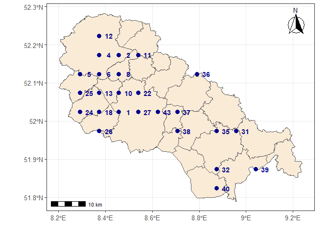

### RingR

-----

`RingR` is a simple tool to circumvent manual data entries using
software `Ring 2.0` to submit bird ringing data to the IFV Helgoland.
*This is not a ready-to-use package, but rather a starting point for
anyone with some experience in programming in R to avoid using another
software to export data which is already well curated in the database of
the user*.

*The package is available as follows*

``` r
if (!("devtools" %in% rownames(installed.packages()))) {
  install.packages("devtools")
} else if (packageVersion("devtools") < 1.6) {
  install.packages("devtools")
}
devtools::install_github("mottensmann/RingR")
```

Currently, the package contains a few functions to create and check
export files:

  - `export.ring`: Export ringing data
  - `check.ring`: check export file
  - `read.lookup`: Open lookup table
  - `place.suggest`: Get suggested place names based on topographic name
    and Tk25 number

See the respective helpfiles if you are interested in these functions to
your own data



<table>

<thead>

<tr>

<th style="text-align:right;">

Number

</th>

<th style="text-align:left;">

strPlaceCode

</th>

</tr>

</thead>

<tbody>

<tr>

<td style="text-align:right;">

1

</td>

<td style="text-align:left;">

Gütersloh; Steinhagen TK3916-4 (DEFL, TK3916)

</td>

</tr>

<tr>

<td style="text-align:right;">

2

</td>

<td style="text-align:left;">

Herford; Spenge TK3816-2 (DEFL, TK3816)

</td>

</tr>

<tr>

<td style="text-align:right;">

3

</td>

<td style="text-align:left;">

Osnabrück; Melle TK3816-2 (DEGW, TK3816)

</td>

</tr>

<tr>

<td style="text-align:right;">

4

</td>

<td style="text-align:left;">

Osnabrück; Melle TK3816-1 (DEGW, TK3816)

</td>

</tr>

<tr>

<td style="text-align:right;">

5

</td>

<td style="text-align:left;">

Gütersloh; Borgholzhausen TK3815-4 (DEFL, TK3815)

</td>

</tr>

<tr>

<td style="text-align:right;">

6

</td>

<td style="text-align:left;">

Herford; Spenge TK3816-3 (DEFL, TK3816)

</td>

</tr>

<tr>

<td style="text-align:right;">

7

</td>

<td style="text-align:left;">

Osnabrück; Melle TK3816-3 (DEGW, TK3816)

</td>

</tr>

<tr>

<td style="text-align:right;">

8

</td>

<td style="text-align:left;">

Herford; Spenge TK3816-4 (DEFL, TK3816)

</td>

</tr>

<tr>

<td style="text-align:right;">

9

</td>

<td style="text-align:left;">

Herford; Bünde TK3816-2 (DEFL, TK3816)

</td>

</tr>

<tr>

<td style="text-align:right;">

10

</td>

<td style="text-align:left;">

Bielefeld; TK3916-2 (DEFL, TK3916)

</td>

</tr>

<tr>

<td style="text-align:right;">

11

</td>

<td style="text-align:left;">

Herford; Spenge TK3817-1 (DEFL, TK3817)

</td>

</tr>

<tr>

<td style="text-align:right;">

12

</td>

<td style="text-align:left;">

Osnabrück; Melle TK3716-3 (DEGW, TK3716)

</td>

</tr>

<tr>

<td style="text-align:right;">

13

</td>

<td style="text-align:left;">

Gütersloh; Werther (Westf.) TK3916-1 (DEFL, TK3916)

</td>

</tr>

<tr>

<td style="text-align:right;">

14

</td>

<td style="text-align:left;">

Gütersloh; Borgholzhausen TK3816-3 (DEFL, TK3816)

</td>

</tr>

<tr>

<td style="text-align:right;">

15

</td>

<td style="text-align:left;">

Gütersloh; Borgholzhausen TK3916-1 (DEFL, TK3916)

</td>

</tr>

<tr>

<td style="text-align:right;">

16

</td>

<td style="text-align:left;">

Gütersloh; Halle (Westf.) TK3916-1 (DEFL, TK3916)

</td>

</tr>

<tr>

<td style="text-align:right;">

17

</td>

<td style="text-align:left;">

Bielefeld; TK3916-4 (DEFL, TK3916)

</td>

</tr>

<tr>

<td style="text-align:right;">

18

</td>

<td style="text-align:left;">

Gütersloh; Halle (Westf.) TK3916-3 (DEFL, TK3916)

</td>

</tr>

<tr>

<td style="text-align:right;">

19

</td>

<td style="text-align:left;">

Gütersloh; Werther (Westf.) TK3916-2 (DEFL, TK3916)

</td>

</tr>

<tr>

<td style="text-align:right;">

20

</td>

<td style="text-align:left;">

Gütersloh; Steinhagen TK3916-3 (DEFL, TK3916)

</td>

</tr>

<tr>

<td style="text-align:right;">

21

</td>

<td style="text-align:left;">

Bielefeld; TK3816-4 (DEFL, TK3816)

</td>

</tr>

<tr>

<td style="text-align:right;">

22

</td>

<td style="text-align:left;">

Bielefeld; TK3917-1 (DEFL, TK3917)

</td>

</tr>

<tr>

<td style="text-align:right;">

23

</td>

<td style="text-align:left;">

Gütersloh; Werther (Westf.) TK3816-3 (DEFL, TK3816)

</td>

</tr>

<tr>

<td style="text-align:right;">

24

</td>

<td style="text-align:left;">

Gütersloh; Halle (Westf.) TK3915-4 (DEFL, TK3915)

</td>

</tr>

<tr>

<td style="text-align:right;">

25

</td>

<td style="text-align:left;">

Gütersloh; Borgholzhausen TK3915-2 (DEFL, TK3915)

</td>

</tr>

<tr>

<td style="text-align:right;">

26

</td>

<td style="text-align:left;">

Gütersloh; Steinhagen TK4016-1 (DEFL, TK4016)

</td>

</tr>

<tr>

<td style="text-align:right;">

27

</td>

<td style="text-align:left;">

Bielefeld; TK3917-3 (DEFL, TK3917)

</td>

</tr>

<tr>

<td style="text-align:right;">

28

</td>

<td style="text-align:left;">

Osnabrück; Melle TK3816-4 (DEGW, TK3816)

</td>

</tr>

<tr>

<td style="text-align:right;">

29

</td>

<td style="text-align:left;">

Herford; Rödinghausen TK3816-2 (DEFL, TK3816)

</td>

</tr>

<tr>

<td style="text-align:right;">

30

</td>

<td style="text-align:left;">

Gütersloh; Werther (Westf.) TK3816-4 (DEFL, TK3816)

</td>

</tr>

<tr>

<td style="text-align:right;">

31

</td>

<td style="text-align:left;">

Lippe; Blomberg TK4019-2 (DEFL, TK4019)

</td>

</tr>

<tr>

<td style="text-align:right;">

32

</td>

<td style="text-align:left;">

Lippe; Detmold TK4119-1 (DEFL, TK4119)

</td>

</tr>

<tr>

<td style="text-align:right;">

33

</td>

<td style="text-align:left;">

Lippe; Detmold TK4019-2 (DEFL, TK4019)

</td>

</tr>

<tr>

<td style="text-align:right;">

34

</td>

<td style="text-align:left;">

Lippe; Lemgo TK4019-2 (DEFL, TK4019)

</td>

</tr>

<tr>

<td style="text-align:right;">

35

</td>

<td style="text-align:left;">

Lippe; Lemgo TK4019-1 (DEFL, TK4019)

</td>

</tr>

<tr>

<td style="text-align:right;">

36

</td>

<td style="text-align:left;">

Lippe; Bad Salzuflen TK3818-4 (DEFL, TK3818)

</td>

</tr>

<tr>

<td style="text-align:right;">

37

</td>

<td style="text-align:left;">

Lippe; Leopoldshöhe TK3918-3 (DEFL, TK3918)

</td>

</tr>

<tr>

<td style="text-align:right;">

38

</td>

<td style="text-align:left;">

Lippe; Lage TK4018-1 (DEFL, TK4018)

</td>

</tr>

<tr>

<td style="text-align:right;">

39

</td>

<td style="text-align:left;">

Lippe; Horn-Bad Meinberg TK4120-1 (DEFL, TK4120)

</td>

</tr>

<tr>

<td style="text-align:right;">

40

</td>

<td style="text-align:left;">

Lippe; Schlangen TK4119-3 (DEFL, TK4119)

</td>

</tr>

<tr>

<td style="text-align:right;">

41

</td>

<td style="text-align:left;">

Lippe; Lage TK4019-1 (DEFL, TK4019)

</td>

</tr>

<tr>

<td style="text-align:right;">

42

</td>

<td style="text-align:left;">

Lippe; Leopoldshöhe TK4018-1 (DEFL, TK4018)

</td>

</tr>

<tr>

<td style="text-align:right;">

43

</td>

<td style="text-align:left;">

Lippe; Leopoldshöhe TK3917-4 (DEFL, TK3917)

</td>

</tr>

<tr>

<td style="text-align:right;">

44

</td>

<td style="text-align:left;">

Gütersloh; Halle (Westf.) TK3915-2 (DEFL, TK3915)

</td>

</tr>

</tbody>

</table>
